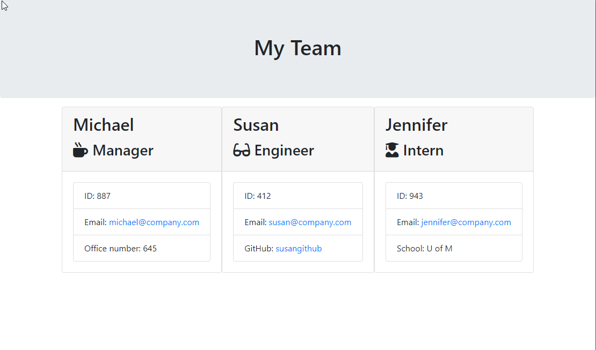

# Employee Summary

#### Table of Contents
  * [Description](#Description)
  * [Installation](#Installation)
  * [Screenshots](#Screenshots)
  * [Tests](#Tests)
  * [Credits](#Credits)
  * [License](#License)

## Description
The application is designed to render and visualize employees based on command line input. Upon starting the app, the user will be prompted to answer a series of questions, four common questions for each user, one specific to each *Employee Type*. The employee types, *Manager*, *Intern*, and *Engineer* are extended from the parent class *Employee*. 

Answers received are rendered by `htmlRenderer.js` which replaces html placeholders found in `Employee_Summary/Develop/templates/` with the answers from the initial prompts. When rendering is complete, `./Develop/output/team.html` is populated with employee data.

* Questions
    * Name
    * ID
    * Email
    * Employee Type:
        * Manager
            * Office Number
        * Intern
            * School Name
        * Engineer
            * GitHub Username

 
## Installation
#### Technologies Used
* HTML
* JavaScript
* [Bootstrap](https://getbootstrap.com/)
* [Node](https://nodejs.org/en/) and [npm](https://www.npmjs.com/package/npm)
* [Visual Studio Code](https://code.visualstudio.com/)
* [cmder](https://cmder.net/)

#### Steps
* Start by entering the following in your terminal: `Git clone https://github.com/whackingMUFN/Employee_Summary.git`

* Change directory to `Employee_Summary/Develop` and enter `npm install` in your terminal. This will install all package dependencies.

* Add node_modules to  .gitignore.

* Start the application by running `node app.js`

See [Tests](#Tests) for tests.

## Screenshots
#### CLI Tour
 

#### Output HTML
 

## Tests
The test files can be found in the `Employee_Summary/Develop/test` folder. 
To run tests, enter `npm test` into the terminal. **Note:** Current directory must be `Employee_Summary/Develop/` or `Employee_Summary/Develop/test`.

#### Test Results

## Credits
This assignment was provided by Trilogy Education Services. The premise was to become familiar with JavaScript classes and subclasses, npm packages, and jest tests. Code was structured based on in class activities and lectures, [MDN](https://developer.mozilla.org/en-US/) Reference Documents for JavaScript syntax [JSHint](https://jshint.com/) for JavaScript validation, and various other online resources. 
## License

[License](https://github.com/whackingMUFN/Homework/WeekFive/LICENSE.txt)
MIT &copy; 2020 Calvin Freese
